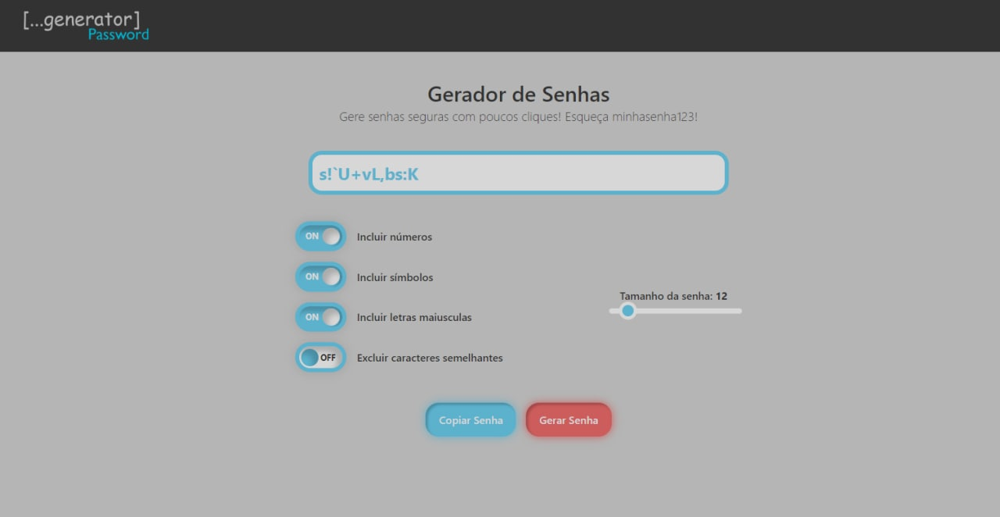

# GERADOR DE SENHAS 🔑

O projeto tem como objetivo gerar senhas aleatórias e seguras para serem usadas no dia a dia.
O sistema está configurado para a personalização de:

+ Incluir números
+ Incluir simbolos
+ Incluir letras maiusculas
+ Excluir caracteres semelhantes
+ Escolher o tamanho da senha entre 4 e 99

Preview:

## Usando o gerenciador de senhas 🔍

`npm i` para baixar as dependências
`npm start` para iniciar o projeto em modo desenvolvimento

##
### Desenvolvido por Henrique Moura 👑